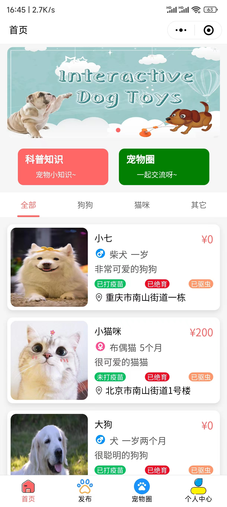
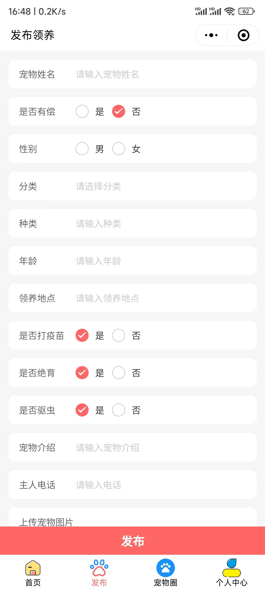
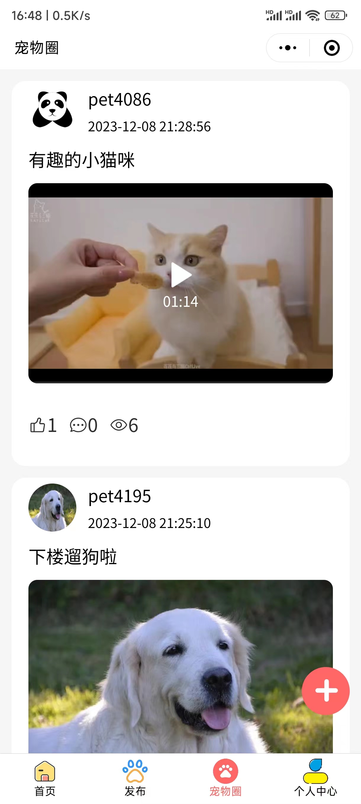
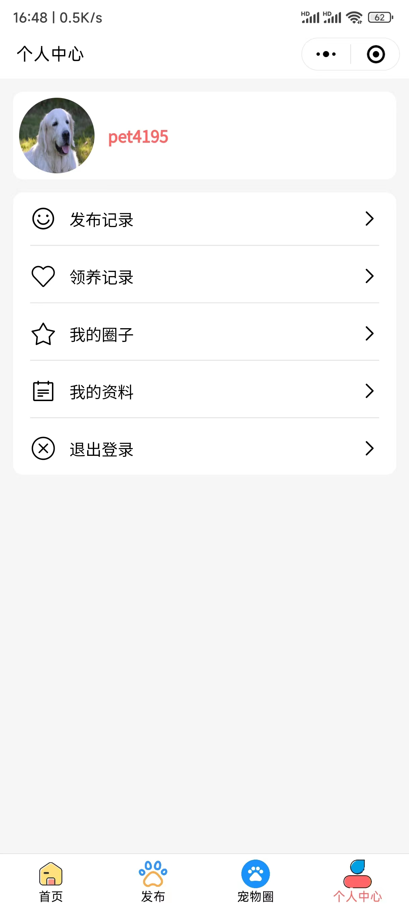
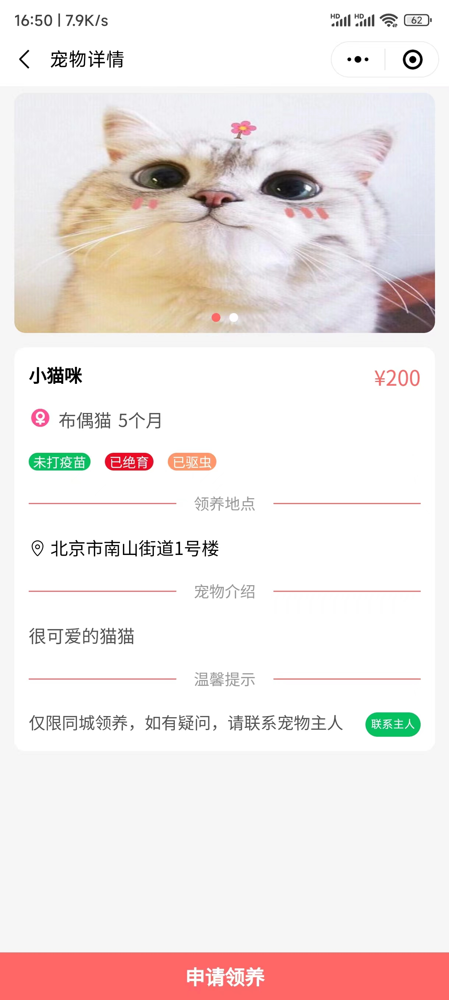
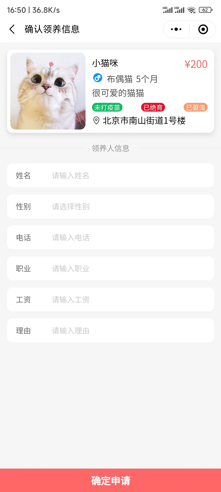
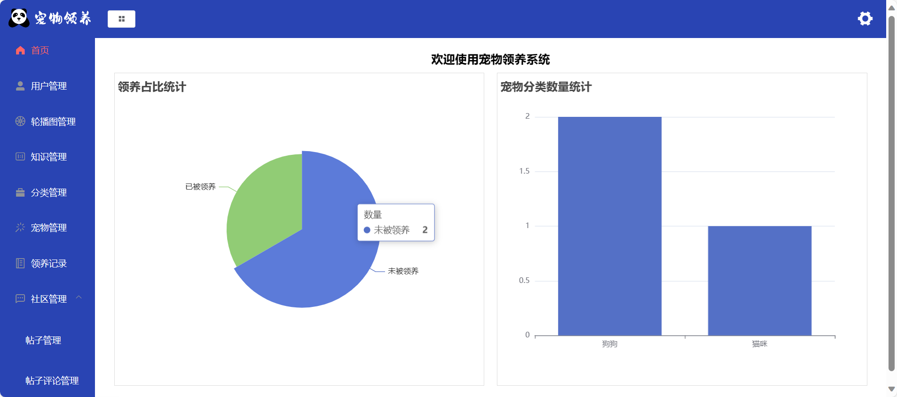

# 宠物领养小程序 流浪动物救助系统（个人独立编写，不是网上资源）
## 一、介绍（获取源码，[查看文章末尾](#四-咨询我们)） 
计算机毕业设计 宠物领养小程序 流浪动物救助系统 前后端分离项目，分为两个角色，管理员和用户 
1. 用户：发布需要被领养的宠物，也可以领养宠物，用户可以审核领养人的信息，是否通过领养，查看科普知识，分享宠物的日常等等 
2. 管理员：用户管理，宠物管理，知识管理等等

[点击我查看更多项目](https://www.yuque.com/rolling-k87y2/qrtzd0/gusuavwrtwe0ingz?singleDoc) 
## 二、技术栈
1. 前端：vue框架，微信原生小程序
2. 后端：nodejs express框架/Java springboot框架
3. 数据库：mysql

## 三、效果展示  
### 1. 用户端（小程序）

### 2. 后台管理（管理端）

## 四、🚀 咨询我们
1. **个人手敲，独立编写项目，不是网上所找的资源**
2. 提示该项目需要付费获取，编码不易，有需要或者疑问可加微信号：rolling_257
3. 扫一扫加我微信好友吧，请备注 宠物领养小程序源码获取

[点击我查看更多项目](https://www.yuque.com/rolling-k87y2/qrtzd0/gusuavwrtwe0ingz?singleDoc) 
